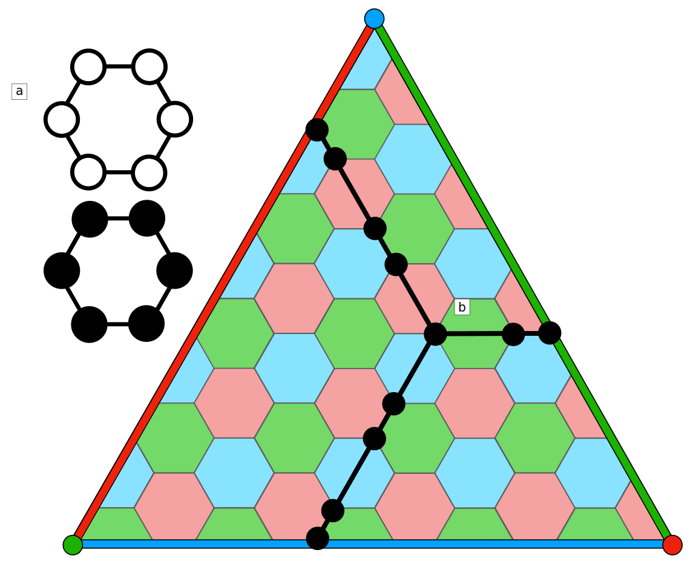
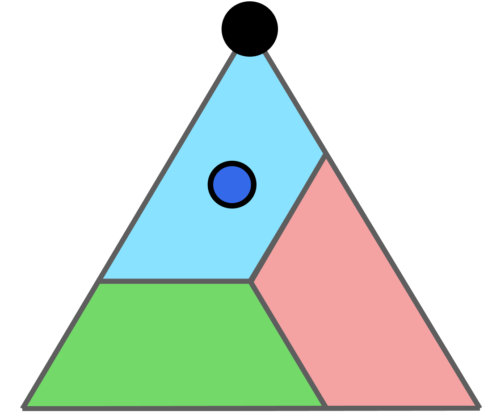
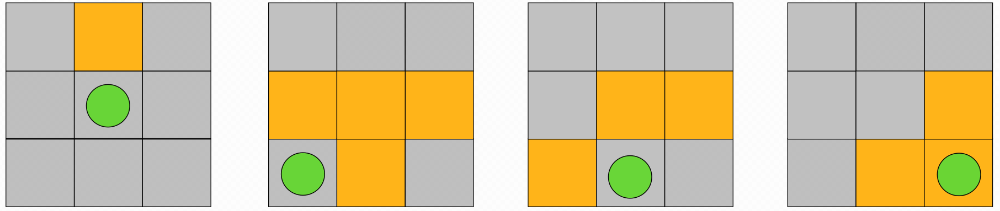
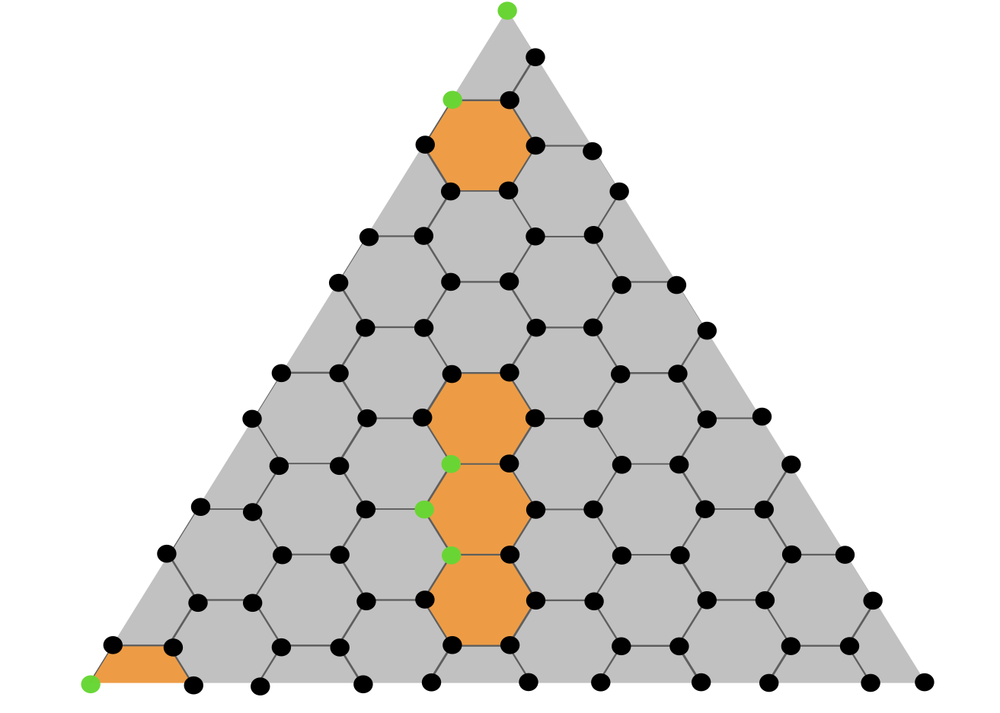

```{code-cell} ipython3
:tags: [remove-cell]
%config InlineBackend.figure_formats = ['svg']
```

<!-- #region -->

# LightsOut decoder for quantum codes

The QECC package provides a decoder for decoding quantum codes based on an analogy to the well-known LightsOut puzzle.
Currently, it supports decoding triangular color codes and allows to conduct numerical experiments on the performance of the decoder considering bit-flip noise with perfect syndrome measurements.
In the following, we will give a brief introduction to quantum codes and the LightsOut puzzle and then show how to use the decoder to decode quantum codes.

## Quantum Codes

As in classical computing, a quantum code protects information from errors by adding redundancy in a certain way to make the information less fragile. A classical binary code is defined as a vector space such that each vector in that space fulfills a set of constraints, called `checks`. For binary codes, the checks of the code are parity checks that determine whether the sum (mod 2) of some entries of a vector is even or odd (equal to 0 or 1).
An important class of quantum codes, `CSS` codes can be seen as a certain combination of two classical codes, i.e., they have two sets of checks. In the following, we consider a simple bit-flip noise model, which implies that we can treat both sets of checks equivalently. As a consequence, we will focus on a single set of checks for the remainder of this notebook.

An example of a quantum code is presented in the following figure.



This is a quantum color code, that is defined on a three-valent and three-colorable lattice with triangular shape.
Each vertex corresponds to a single bit of the code and the checks correspond to the faces, i.e., each face computes the sum (mod 2) of the bits around it. If a vector satisfies all checks, it is a codeword of the code. However, in case an error occurs on a single bit, the checks in which the bit is involved in, i.e., the faces around the vertex of the bit will indicate that the sum is not even anymore, and hence will indicate an error happened. This is illustrated in the following figure for a small triangular color code


The decoding task is now, given a set of violated checks, i.e., marked faces, to find a set of bits to flip such that no check is violated anymore. In case of the example above, flipping the bit on the very top of the triangle is a valid decoding estimate.

## LightsOut puzzle

We solve the problem of decoding quantum codes by a reduction to the well-known mathematical puzzle `LightsOut`. Originally, the puzzle is defined on a rectangular lattice whose faces correspond to lights that can be turned on or off. Pressing a light toggles the light (from on to off and vice versa) as well as all adjacent lights around it. The puzzle starts out in an initial configuration where some lights are turned on and the goal is to find a sequence of lights to press (a sequence of `moves` such that all lights are turned off), as illustrated in the following figure:



To show how this can be used to decode a code, consider the following variation where: the faces correspond to lights and the vertices correspond to switches that toggle all lights around them. For the triangular color code, the LightsOut variant and an example of an initial configuration and a solution to the puzzle is given in the following figure



Our decoder uses a satisfiability formulation (MaxSAT) of the LightsOut puzzle, to find a minimal set of switches that turns off all the lights.

## Using QECC to decode quantum codes using the LightsOut solution

First, we need to construct the lattice of the underlying quantum code. For this we use the `HexagonalColorCode` object which constructs a hexagonal lattice with triangular shape as depicted above, given the side length as the only parameter.

<!-- #endregion -->

```{code-cell} ipython3
from mqt.qecc.codes import HexagonalColorCode

side_length = 3
lattice = HexagonalColorCode(side_length)
```

Then, using the lattice, we construct a `LightsOut` puzzle object that manages the construction of the satisfiability formulation.
In the formulation, each switch corresponds to a Boolean propositional variable and each check is realized as a parity constraint involving all switch variables surrounding a light.
The satisfiability formulation is constructed using the `preconstruct_z3_instance` method. This method constructs parts of the formulation that are independent of the initial configuration of the LightsOut puzzle. This allows to reuse the formulation for different initial configurations.

```{code-cell} ipython3
from mqt.qecc.cc_decoder.decoder import LightsOut

problem = LightsOut(lattice.faces_to_qubits, lattice.qubits_to_faces)
problem.preconstruct_z3_instance()
```

Now we can construct the satisfiability formulation for a specific initial configuration of the LightsOut puzzle.
To do so, we need to define a list that indicates which lights are initially on. For the example above, we can set the first light to be on and the other two to be off.

```{code-cell} ipython3
lights = [True, False, False]
```

Now we can solve the LightsOut puzzle for the given initial configuration, i.e., we find a minimal set of switches that turns off all the lights.
This is done using the `solve` method of the `LightsOut` object. This method takes the initial configuration of the LightsOut puzzle as input and returns a set of switches that constitute a solution to the LightsOut puzzle and the time needed to construct the satisfiability formulation and the solving time of the MaxSAT solver.

```{code-cell} ipython3
switches, constr_time, solve_time = problem.solve(lights)
```

<!-- #region -->

### Running numerical experiments

The QECC package also provides a function to run numerical experiments on the performance of the decoder.
Currently, the decoder is only implemented for the triangular color code and considering bit-flip noise with perfect syndrome measurements.

To start `n` simulations for a distance `d` triangular color code assuming a bit-flip error rate of `p`, the following Python script can be used.

```{code-cell} ipython33
from mqt.qecc.cc_decoder import decoder

d = 21  # distance of the triangular code to simulate
p = 0.01  # (bit-flip) error rate
n = 1000  # number of simulations to run
decoder.run("hexagon", distance=d, error_rate=p, nr_sims=n)
```

Alternatively, the numerical simulation methods are available from the command line via the `mqt.qecc.cc-decoder` command.
Type `mqt.qecc.cc-decoder --help` to see the available options.

```bash
$ mqt.qecc.cc-decoder --help
usage: mqt.qecc.cc-decoder [-h] [--nr_sims NR_SIMS] [--results_dir RESULTS_DIR] [--decoder DECODER] [--solver SOLVER] distance error_rate

positional arguments:
  distance              the distance of the code
  error_rate            the error rate

options:
  -h, --help            show this help message and exit
  --nr_sims NR_SIMS     the number of simulations to run. Default: 10000
  --results_dir RESULTS_DIR
                        the directory to save the results to. Default: ./results
  --decoder DECODER     the decoder to use (maxsat or tn). Default: maxsat
  --solver SOLVER       maxsat solver to use (path to a executable). Default: z3
```

<!-- #endregion -->

Check out the [reference documentation](#mqt.qecc.cc_decoder.decoder.LightsOut) for more information.
