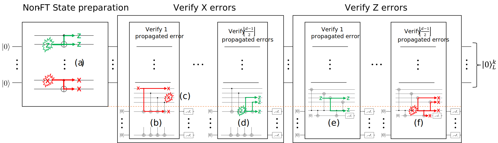
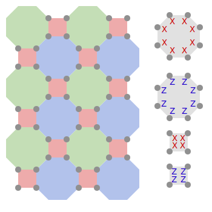

---
jupyter:
  jupytext:
    text_representation:
      extension: .md
      format_name: markdown
      format_version: "1.3"
      jupytext_version: 1.16.7
  kernelspec:
    display_name: Python 3 (ipykernel)
    language: python
    name: python3
---

# Fault tolerant state preparation of Pauli eigenstates for CSS codes

The QECC package contains functionality for synthesizing and simulating fault tolerant and non-fault tolerant state preparation circuits for Pauli eigenstates of CSS codes.
Currently it supports synthesizing circuits for preparing the $|0\rangle_L^k$ and $|+\rangle_L^k$ states of arbitrary $[[n,k,d]]$ CSS codes.

## Synthesizing non-FT state preparation circuits

A non-fault tolerant preparation circuit can be generated directly from a CSS code. Let's consider the [Steane code](https://errorcorrectionzoo.org/c/steane) which is a $[[7, 1, 3]]$ color code.

```python
from mqt.qecc import CSSCode

steane_code = CSSCode.from_code_name("Steane")
print(steane_code.stabs_as_pauli_strings())
```

A state preparation circuit for the logical $|0\rangle_L$ of this code is a circuit that generates a state that is stabilized by all of the above Pauli operators and the logical $Z_L$ operator of the Steane code.

The code is small enough that we can generate a CNOT-optimal state preparation circuit for it:

```python
from mqt.qecc.circuit_synthesis import gate_optimal_prep_circuit

non_ft_sp = gate_optimal_prep_circuit(steane_code, zero_state=True, max_timeout=2)

non_ft_sp.circ.draw(output="mpl", initial_state=True)
```

We see that the minimal number of CNOTs required to prepare the logical $|0\rangle_L$ circuit of the Steane code is $8$.

## Synthesizing FT state preparation circuits

The circuit above is not fault-tolerant. For example, an $X$ error on qubit $q_1$ before the last CNOT propagates to a weight $2$ X error on $q_1$ and $q_2$. This is to be expected since we apply two-qubit gates between the qubits of a single logical qubit.

A common method to turn a non-FT protocol into a fault tolerant one is through post-selection. We can try to detect whether an error was propagated through the circuit and restart the preparation in case of a detection event. A circuit performing such measurements is called a _verification circuit_.

Verification circuits need to be carefully constructed such that only stabilizers of the code are measured and no more measurements are performed than necessary. Finding good verification circuits is NP-complete.

QECC can automatically generate optimal verification circuits.

```python
from mqt.qecc.circuit_synthesis import gate_optimal_verification_circuit

ft_sp = gate_optimal_verification_circuit(non_ft_sp)

ft_sp.draw(output="mpl", initial_state=True)
```

We have just automatically generated the known FT state preparation circuit for the Steane
code: [^1]. We see that if an X error happens on qubit $q_1$ before the last CNOT causes the verification circuit to measure a $-1$.

## Simulating state preparation circuits

If we want to see the probability of a logical error happening after post-selecting, QECC provides simulation utilities that can quickly generate results. We can simulate the non-FT and FT circuits and compare the results.

[^1]: https://www.nature.com/articles/srep19578

```python
from mqt.qecc.circuit_synthesis import NoisyNDFTStatePrepSimulator

p = 0.05

non_ft_simulator = NoisyNDFTStatePrepSimulator(
    non_ft_sp.circ, code=steane_code, zero_state=True, p=p
)
ft_simulator = NoisyNDFTStatePrepSimulator(
    ft_sp, code=steane_code, zero_state=True, p=p
)


pl_non_ft, ra_non_ft, _, _ = non_ft_simulator.logical_error_rate(min_errors=10)
pl_ft, ra_ft, _, _ = ft_simulator.logical_error_rate(min_errors=10)

print(f"Logical error rate for non-FT state preparation: {pl_non_ft}")
print(f"Logical error rate for FT state preparation: {pl_ft}")
```

The error rates seem quite close to each other. To properly judge the fault tolerance of the circuits we want to look at how the logical error rate scales with the physical error rate.

```python
ps = [0.1, 0.05, 0.01, 0.008, 0.006, 0.004, 0.002, 0.001]

non_ft_simulator.plot_state_prep(ps, min_errors=50, name="non-FT", p_idle_factor=0.01)
ft_simulator.plot_state_prep(ps, min_errors=50, name="FT", p_idle_factor=0.01)
```

Indeed we observe a quadratic scaling for the fault tolerant state preparation circuit while the logical error rate scales linearly for the non-fault tolerant state preparation.

## Beyond distance 3

Distance 3 circuits are particularly simple for fault tolerant state preparation because for the $|0\rangle_L$ we can completely ignore Z errors. Due to error degeneracy any Z error is equivalent to a weight 1 or 0 error.

Additionally one has to pay special attention to the order of measurements in the verification circuits when more than one independent error in the state preparation circuit is considered.

Because both error types are considered, the verification circuit now measures both X- and Z-stabilizers. Unfortunately a Z error in an X measurement can propagate to the data qubits and vice versa for Z measurements. Therefore, if we check for Z errors after we have checked for X errors the measurements might introduce more X errors on the data qubits. We can check those again but that would just turn the situation around; now Z errors can propagate to the data qubits.

Detecting such _hook errors_ can be achieved via flag-fault tolerant stabilizer measurements [^1]. Usually, information from such hook errors is used to augment an error correction scheme. But we can also use these flags as additional measurements on which we post-select. If one of the flags triggers, this indicates that a hook error happened and we reset.

By default QECC automatically performs such additional measurements when necessary. The general construction is sketched in the following figure.



Let's consider a larger code to illustrate the point. The [square-octagon color code](https://errorcorrectionzoo.org/c/488_color) is defined on the following lattice:



The distance 5 code uses 17 qubits from this lattice, i.e., we have a $[[17, 1, 5]]$ CSS code. Given the size of the code, synthesizing an optimal state preparation circuit might take a long time. QECC also has a fast heuristic state preparation circuit synthesis.

[^1]: https://arxiv.org/abs/1708.02246

```python
from mqt.qecc.circuit_synthesis import heuristic_prep_circuit
from mqt.qecc.codes import SquareOctagonColorCode

cc = SquareOctagonColorCode(5)
cc_non_ft_sp = heuristic_prep_circuit(cc, zero_state=True, optimize_depth=True)

cc_non_ft_sp.circ.draw(output="mpl", initial_state=True, scale=0.7)
```

Even though optimal state preparation circuit synthesis seems out of range we can still synthesize good verification circuits in a short time if we give an initial guess on how many measurements we will need.

```python
cc_ft_sp = gate_optimal_verification_circuit(
    cc_non_ft_sp, max_timeout=2, max_ancillas=3
)

cc_ft_sp.draw(output="mpl", initial_state=True, fold=-1, scale=0.2)
```

We see that the overhead for the verification overshadows the state preparation by a large margin. But this verification circuit is still much smaller than the naive variant of post-selecting on the stabilizer generators of the code.

```python
from mqt.qecc.circuit_synthesis import naive_verification_circuit

cc_ft_naive = naive_verification_circuit(cc_non_ft_sp)

print(
    f"CNOTs required for naive FT state preparation: {cc_ft_naive.num_nonlocal_gates()}"
)
print(
    f"CNOTs required for optimized FT state preparation: {cc_ft_sp.num_nonlocal_gates()}"
)
```

We expect that the distance 5 color code should be prepared with a better logical error rate than the Steane code. And this is indeed the case:

```python
cc_simulator = NoisyNDFTStatePrepSimulator(cc_ft_sp, code=cc, zero_state=True)

ps = [0.1, 0.05, 0.04, 0.03, 0.02, 0.01, 0.009, 0.008]

ft_simulator.plot_state_prep(
    ps, min_errors=50, name="Distance 3", p_idle_factor=0.01
)  # simulate Steane code as comparison
cc_simulator.plot_state_prep(ps, min_errors=50, name="Distance 5", p_idle_factor=0.01)
```

## Deterministic state preparation ($d < 5$)

A possible disadvantage of the above approach is that the verification circuits are non-deterministic. This means that we potentially have to run the circuit multiple times to successfully prepare the state. This can be circumvented by using the information gained from the verification measurements to possibly identify the dangerous error and correct it. If this this is done for every possible (single) error, we refer to the state preparation as deterministic [^2].

For small codes ($d < 5$ i.e., we need to consider only a single error) this problem is still tractable and can be solved in an optimal way using satisfiability solvers. QECC can automatically generate deterministic state preparation circuits for such codes.

[^2]: https://arxiv.org/abs/2301.10017

For this we come back to our $d=3$ Steane code.

```python
non_ft_sp.circ.draw(output="mpl", initial_state=True)
```

And initialize an instance of the deterministic verification helper class to facilitate the generation of the deterministic FT state preparation circuit.

```python
from mqt.qecc.circuit_synthesis import DeterministicVerificationHelper

det_helper = DeterministicVerificationHelper(non_ft_sp)
```

Calling the `get_solution` method will generate the non-deterministic verification circuit using either the optimal or the heuristic method discussed above. The deterministic verification circuit, separated into X and Z correction layers) is then generated using the satisfiability solver.

```python
det_verify = det_helper.get_solution(use_optimal_verification=True)
det_verify_x, det_verify_z = det_verify
```

Such a `DeterministicVerification` object contains the stabilizer measurements for the non-deterministic verification circuit, the stabilizer measurements for the different deterministic verification circuits, depending on the non-deterministic measurement outcomes, and the final correction Pauli operators that need to be applied to the data qubits.

The non-deterministic verification measurements are stored in the `stabs` attribute as a list of numpy arrays where each array represents a stabilizer measurement.

```python
det_verify_x.stabs
```

The deterministic verification measurements are stored in the `det_stabs` attribute as a dictionary where the keys are the non-deterministic measurement outcomes (converted to int) and the values is a tuple with the first element being the deterministic stabilizer measurements and the second element being again a dictionary with the Pauli corrections for the deterministic measurement outcomes.

For example for the Steane code whenever the non-deterministic verification triggers (1) the logical operator on qubits 2,3,6 hast to measured. If the outcome is 1, a Pauli correction on qubit 3 has to be applied, otherwise no correction is necessary.

```python
det_verify_x.det_correction
```

For the case where the non-deterministic verification measurements need to be flagged (not the case for the Steane code), the `hook_corrections` attribute contains the additional stabilizer measurements and corrections in the same format as the `det_stabs` attribute.

```python
det_verify_x.hook_corrections
```

### Simulating deterministic state preparation circuits with Qsample

The resulting `DeterministicVerification` object can be used to directly simulate the deterministic state preparation circuit using the [Qsample](https://github.com/dpwinter/qsample) under the hood. The `NoisyDFTStatePrepSimulator` class automatically constructs a valid Qsample protocol containing the correct circuits and conditional paths to simulate the deterministic state preparation. The passed Error Model and simulation parameters are directly passed to Qsample and explained in the [Qsample documentation](https://dpwinter.github.io/qsample/). Similarly also the Qsample callbacks can be used to e.g. directly plot the logical error rates, showing the expected quadratic scaling.

```python
from qsample import callbacks, noise

from mqt.qecc.circuit_synthesis import NoisyDFTStatePrepSimulator

error_model = noise.E1_1  # depolarizing error model
err_params = {"q": [1e-4, 5e-4, 1e-3, 5e-3, 1e-2, 5e-2, 1e-1, 5e-1]}
shots_dss = 2000
p_max = {"q": 0.01}
L = 1

qsample_sim = NoisyDFTStatePrepSimulator(
    non_ft_sp.circ, det_verify, steane_code, error_model
)
sampling_stats = qsample_sim.dss_logical_error_rates(
    err_params, p_max, L, shots_dss, callbacks=[callbacks.PlotStats()]
)
```

# Circuits and Evaluations

The circuits and benchmark scripts used for our non-deterministic work https://arxiv.org/abs/2408.11894, can be found [here](https://github.com/cda-tum/mqt-qecc/tree/main/scripts/ft_stateprep/eval) and for the deterministic work [here](https://github.com/cda-tum/mqt-qecc/tree/main/scripts/ft_stateprep/eval_det).
